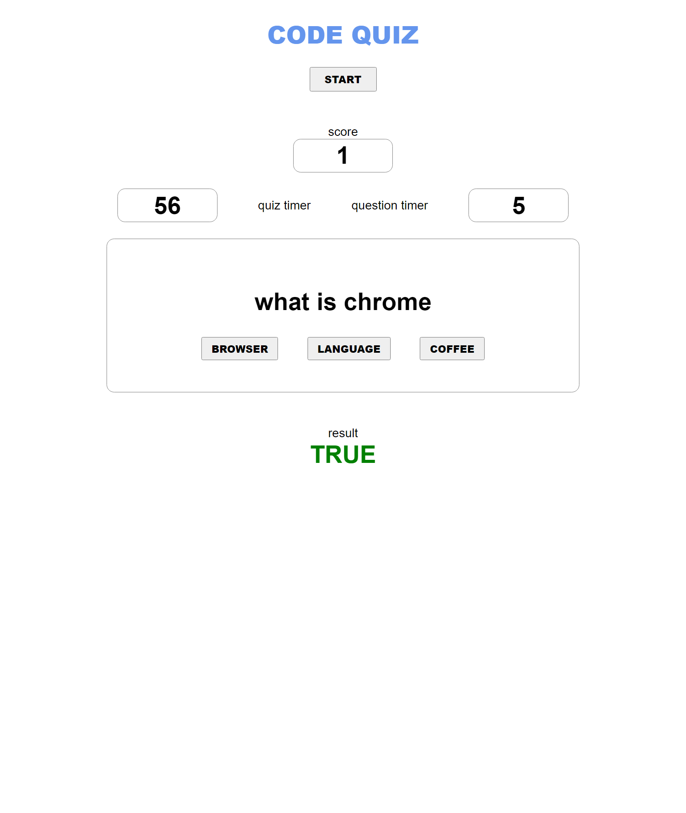

# Java Script Quiz
[Deployed Application](https://hunter-williams.github.io/code-quiz/)
[GitHub](https://github.com/hunter-williams/code-quiz)

## Criteria 
- WHEN I click the start button
- THEN a timer starts and I am presented with a question
- WHEN I answer a question
- THEN I am presented with another question
- WHEN I answer a question incorrectly
- THEN time is subtracted from the clock
- WHEN all questions are answered or the timer reaches 0
- THEN the game is over
- WHEN the game is over
- THEN I can save my initials and score